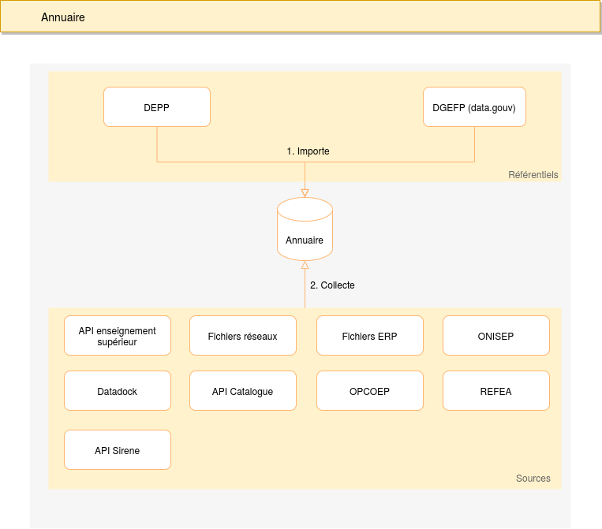

# Référentiel

Le référentiel regroupe les organismes qui dispensent ou ont dispensé des formations en apprentissage.

Il se base sur trois listes d'organismes fournies par la DEPP, la DGEFP et la mission apprentissage.

Ces organismes sont importés dans le référentiel au moyen de scripts des scripts vont ensuite collecter des informations
dans les différentes sources dont la mission apprentissage dispose :

- Fichiers réseaux
- Datadock
- Catalogue des formations
- Fichiers ERP
- ONISEP
- REFEA
- API Sirene



## API

L'api permet de consulter les organismes importés.

Cet API est actuellement composée de deux routes.

Pour plus détails vous pouvez consulter la documentation [Swagger](https://referentiel.apprentissage.beta.gouv.fr/api/v1/doc/#/Publique/post_api_v1_organismes).

### /api/v1/organismes

Permet de rechercher et exporter des organismes du référentiel

Exemple : https://referentiel.apprentissage.beta.gouv.fr/api/v1/organismes

### /api/v1/organismes/:siret

Permet d'obtenir les informations relatives à un organisme à partir de son numéro de SIRET

Exemple : https://referentiel.apprentissage.beta.gouv.fr/api/v1/organismes/77928324100056

## Développement


### Pré-requis

- Docker 19+
- Docker-compose 1.27+

### Démarrage

#### Lancement de l'application

```sh
make install
make start
```

Cette commande démarre les containers définis dans le fichier `docker-compose.yml` et `docker-compose.override.yml`

L'application est ensuite accessible à l'url [http://localhost](http://localhost)


#### Construction du référentiel

Une fois que l'application a été démarée, il faut construire le référentiel en lancant un script.
Le référentiel utilise plusieurs API dont certaines requièrent une authentification il est donc nécessaire de configurer des variables d'environnement.

Il faut donc éditer le fichier `server/.env` et ajouter les variables suivantes :

```
REFERENTIEL_OVH_STORAGE_URI=...
REFERENTIEL_SIRENE_API_CONSUMER_KEY=...
REFERENTIEL_SIRENE_API_CONSUMER_SECRET=...
```

Pour obtenir les valeurs, vous devez demander une habilitation qui vous permettra de les récupérer depuis le vault.

Une fois le fichier `server/.env` valorisé, vous devez lancer la commande suivante :

```sh
cd server
yarn cli build
```

Cette commande va importer toutes les données nécessaires puis collecter les informations relatives aux organismes.

Un fois terminée, vous pourrez consulter les organismes à l'url [http://localhost/organismes](http://localhost/organismes)


## Développement sans Docker

Il est possible de faire tourner cette application en local sans Docker.
Il est nécessaire d'installer un MongoDB "natif" sur la machine. Il est également possible de restaurer un dump de production pour pouvoir travailler sur les données:

```bash
mongorestore --host 127.0.0.1:27017 \
--gzip \
--archive=prodonisep-mongodb-2023-05-03_072312 \
--db referentiel
```

Testé sour macOS et Ubuntu 22.

Note: sous Ubuntu 22, il y a un soucis avec `mongodb-memory-server` qui nécessite une lib spécifique. Il faut l'installer "à la main":

```bash
wget http://archive.ubuntu.com/ubuntu/pool/main/o/openssl/libssl1.1_1.1.1f-1ubuntu2_amd64.deb
sudo dpkg -i libssl1.1_1.1.1f-1ubuntu2_amd64.deb
```


### Installation

```bash
cd referentiel
make install-server
# yarn --cwd server install --frozen-lockfile
make install-ui
# yarn --cwd ui install --frozen-lockfile
make generate-dotenv
make hooks
```

### Lancement du serveur

Ensuite, pour faire tourner le serveur, il est nécessaire de renseigner les valeurs pour le serveur Mongo et pour le port sur lequel il doit tourner (on prend ici 5001 car par exemple sous macOS le port 5000 est utilisé):

```bash
export REFERENTIEL_MONGODB_URI='mongodb://127.0.0.1:27017/referentiel?retryWrites=true&w=majority'
export REFERENTIEL_PORT=5001
```

Il faut également renseigner les variables suivantes (il n'est nécessaire de les renseigner avec de vraies valeurs que si l'on veut faire une mise à jour):

```bash
export REFERENTIEL_OVH_STORAGE_URI=nope
export REFERENTIEL_SIRENE_API_CONSUMER_KEY=nope
export REFERENTIEL_SIRENE_API_CONSUMER_SECRET=nope
export REFERENTIEL_API_ACCE_USERNAME=nope
export REFERENTIEL_API_ACCE_PASSWORD=nope
export CATALOGUE_API_USERNAME=nope
export CATALOGUE_API_PASSWORD=nope
export TABLEAU_DE_BORD_API_KEY=nope
export TABLEAU_DE_BORD_PUBLIC_URL=nope
```

Pour lancer le serveur:

```bash
yarn --cwd server start
```

### Lancement du front

Ici, comme il n'y a pas de "reverse proxy" comme dans la conf Docker, on précise l'URL complète de l'API qui sera utlisée par le front:

```bash
# export NODE_OPTIONS=--openssl-legacy-provider  # nécessaire sous macOS/Ubuntu22
export REACT_APP_REFERENTIEL_API_URL=http://localhost:5001/api/v1  
yarn --cwd ui start
```


